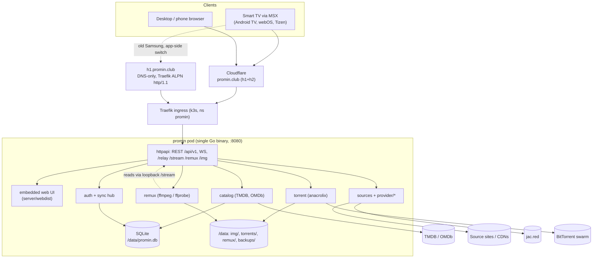
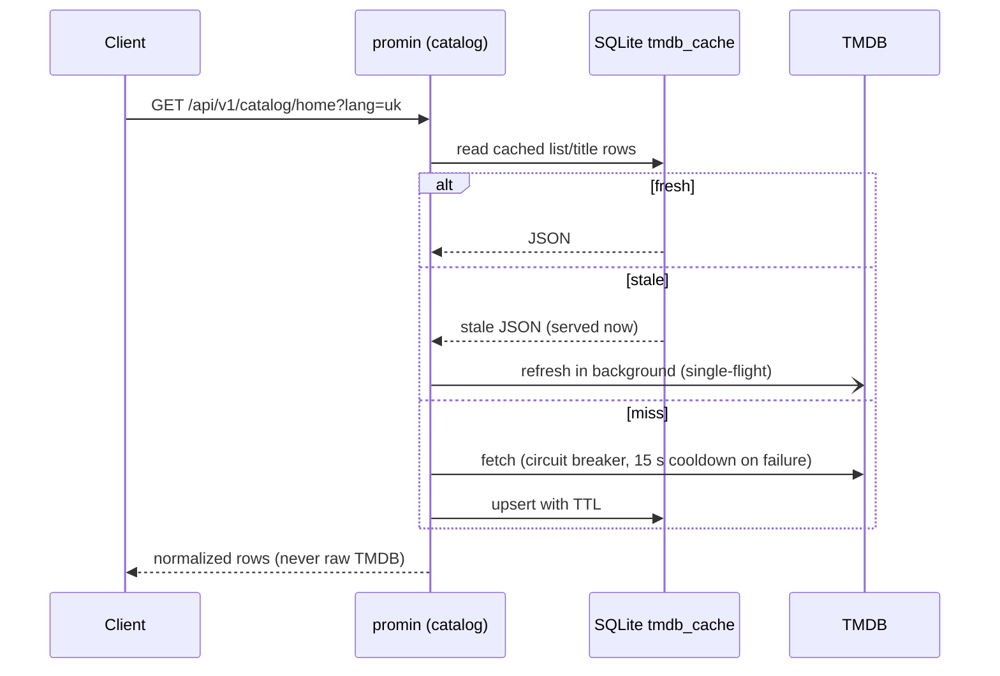
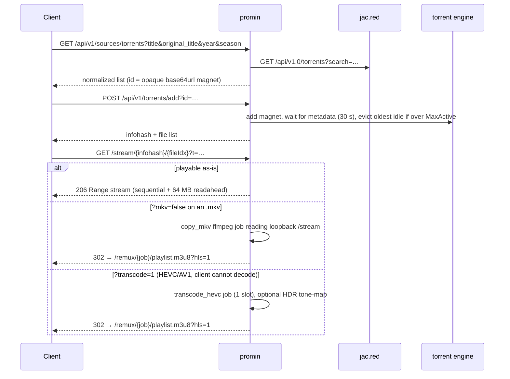
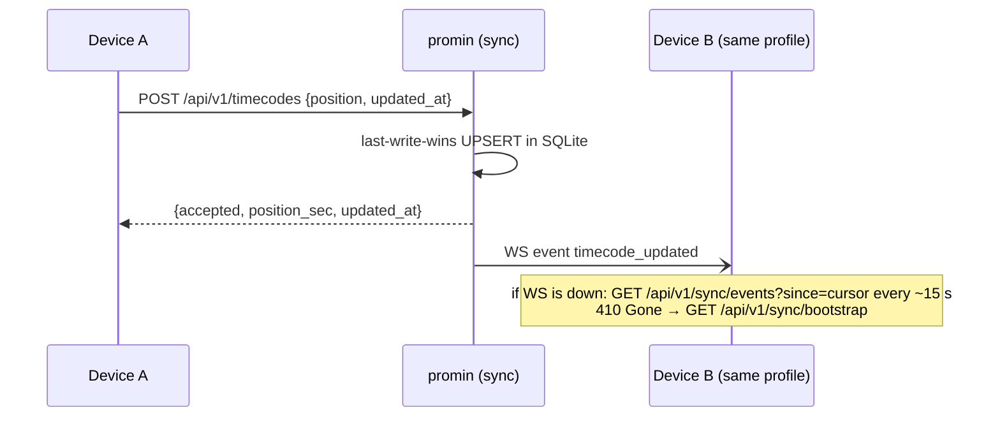

# Architecture

Promin is a self-hosted media portal for Smart TVs. One Go binary serves a
TMDB-backed catalog, finds online streams through built-in native providers,
searches and streams torrents, and keeps PIN-based household profiles in sync
across devices. Clients open it through Media Station X (MSX) or any browser.

## 1. What Promin is

- **Catalog** — movies, series, cartoons, anime, search and filters. Data comes
  from TMDB through a server-side proxy cache; the client never talks to TMDB.
  IMDb ratings are enriched from OMDb when a key is configured.
- **Online sources** — native scraper providers under
  `server/providers/*` (a private git submodule, one package per source). Online sources are
  implemented natively; there is no external scraper sidecar.
- **Torrents** — magnet search through the public JacRed API (`jac.red`), an
  embedded `anacrolix/torrent` engine, HTTP Range streaming, on-disk LRU cache.
- **Accounts + sync** — household profiles entered by a 6-digit PIN on the TV,
  an admin panel on the phone, bookmarks/playlists/history/timecodes/settings
  stored in SQLite and pushed to every device over WebSocket.
- **Playback** — the browser `<video>` element (plus a bundled hls.js), with a
  server-side ffmpeg remux/transcode path for TVs that cannot play a source as-is.
- **Extras** — idle screensaver with random backdrops and an open-meteo weather
  strip, a `/logs` live log viewer, an `/onboarding` help page.

## 2. Runtime components



| Component | What it is | Where |
|---|---|---|
| `promin` binary | Go 1.25, CGO-free, serves everything on `:8080` | `server/cmd/promin/main.go` |
| Web UI | Vanilla TypeScript compiled to ES5, embedded with `go:embed` | `web/`, `server/webdist/embed.go` |
| SQLite | `modernc.org/sqlite`, WAL, one file on the PVC | `server/internal/store` |
| ffmpeg / ffprobe | Alpine package pinned in the image (6.1.x), spawned per job | `Dockerfile`, `server/internal/remux` |
| Torrent engine | `github.com/anacrolix/torrent` in-process, data under `/data/torrents` | `server/internal/torrent` |
| Traefik + cert-manager | Ingress for `promin.club`; second Ingress with a `TLSOption` advertising only `http/1.1` for `h1.promin.club` | `k8s/promin.yaml` |
| Cloudflare | Fronts `promin.club` (h2, compression, `CF-IPCountry`) | DNS |
| Secrets | `promin-secrets` (admin password, native source base URL), `promin-logs`, `lampac-proxy` (residential proxy URL, historical name) | k8s namespace `promin` |

Deployment is a single `Deployment` with `strategy: Recreate` (RWO volume),
a 40 Gi `local-path` PVC and a `/healthz` readiness probe. The image is built by
`.github/workflows/promin.yml` and imported into the node's containerd.

### The HTTP/1.1-only host

Pre-2022 Samsung Tizen (Chromium ~47) drops sustained media transfers over
HTTP/2. Cloudflare always negotiates h2, so those TVs use `h1.promin.club`: a
DNS-only record (no Cloudflare proxy) served by Traefik with
`TLSOption alpnProtocols: ["http/1.1"]`. There is no User-Agent sniffing; the
device-local "old TV mode" switch in the app moves the device to
`PROMIN_H1_HOST` and back to `PROMIN_MAIN_HOST` (both hosts are reported by
`GET /api/v1/ping`). Both hosts hit the same pod; only the transport differs.
A legacy nginx front with HTTP/2 disabled on `promin.sviniabanditka.com:8444`
(`k8s/promin-h1.yaml`) is still deployed as a transition alias.

## 3. Request flow

### Entry and auth

1. MSX loads `GET /msx/start.json`, which is generated from the request `Host`
   and points at the SPA (`/`).
2. The SPA shows the PIN screen; `POST /api/v1/auth/pin` mints an opaque
   session token for the profile whose PIN matches.
3. Every data route requires `Authorization: Bearer <token>`. Media routes
   (`/relay`, `/stream`, `/remux/*`, `/api/v1/ws`) also accept `?t=<token>`
   because `<video>` and WS upgrades cannot set headers. `/img/*`, `/healthz`,
   `/api/v1/ping`, `/api/v1/diag`, `/onboarding`, `/admin*` and the static shell
   are the only open routes. There is no toggle; the gate is always on.

### Catalog



Posters and backdrops go through `/img/{size}/{file}`, cached permanently on
disk under `/data/img`. Authenticated home requests add a "continue watching"
shelf and recommendation shelves built cache-first from the user's finished
titles (`server/internal/catalog/recommend.go`).

### Pipeline A: online source → `/relay` or `/remux`

```mermaid
sequenceDiagram
    participant C as Client
    participant P as promin
    participant N as native provider
    participant CDN as Source CDN
    C->>P: GET /api/v1/sources/online?tmdb_id&type&title&year
    P->>N: search + strict title/year match (cached 7 d, miss 15 min)
    P-->>C: list of available providers
    C->>P: GET /api/v1/sources/online/resolve?balanser=&season&episode&voice&demuxed_hls
    P->>N: title page + player pages (25 s budget)
    N-->>P: raw stream URL(s), subtitles, voices
    P-->>C: streams wrapped as /relay?u=… (or /remux?u=…&kind=copy_hls when demuxed_hls=false)
    C->>P: GET /relay?u=<base64url>&t=
    P->>CDN: fetch (Range passed through, SSRF guard, browser UA)
    CDN-->>P: bytes / m3u8 / srt
    P-->>C: m3u8 rewritten so every URI points back at /relay; SRT converted to WebVTT
```

Stream URLs are never cached — CDN links carry expiring tokens. Only the
TMDB→source-id match is cached, in the shared `tmdb_cache` table.

### Pipeline B: torrent → engine → `/stream`



The client decides whether it needs `mkv=false` or `transcode=1` from its own
capabilities and the release name; the server does not sniff the device.
Torrents with no open reader for 10 minutes are dropped from the swarm; their
data stays on disk until the LRU sweep (every 5 minutes) pushes total size
below `PROMIN_TORRENT_CACHE_LIMIT_GB`.

### Sync



## 4. Architectural decisions that hold

- **Own UI, no framework.** Vanilla TS → ES5 bundle, because the oldest target
  webview is Chromium ~47. Layout follows the classic Lampa look, code is ours.
- **One Go binary, SQLite, no other services.** No Postgres/Redis/broker; the
  remux queue, sync hub, rate limiters and log ring are in-memory. Static UI is
  embedded, so the image is the only deploy artifact.
- **Own sync, server is the source of truth.** Clients cache locally for instant
  paint, but every conflict resolves to SQLite; timecodes use client
  `updated_at` last-write-wins.
- **PIN profiles instead of passwords.** A household box needs a remote-friendly
  gate: 6-digit PIN → profile, admin (user 1) manages profiles from a phone.
  Sessions never expire on TVs; admin sessions expire after 2 hours.
- **Embedded torrent engine instead of TorrServer.** `anacrolix/torrent`
  in-process, sequential piece priority, Range streaming, disk LRU.
- **TMDB only via the proxy cache.** Key stays server-side, TVs on filtered
  networks still work, cards are normalized DTOs. Stale-while-revalidate plus a
  circuit breaker keep home rendering during TMDB outages; the household's own
  library is prewarmed into the cache every 6 hours.
- **Old Samsung is a first-class platform.** ES5, the h1-only host, `-c copy`
  remuxes and a bounded HEVC→H264 transcode are part of the design, not a patch.
- **Resource budget.** ~3 vCPU for the stack: one transcode at a time
  (`PROMIN_REMUX_MAX_TRANSCODES=1`), 3 active torrents in production, 2 Gi memory
  limit, torrent cache capped by size.
- **Deliberate client-side media decisions.** The TV knows whether it can decode
  HEVC or demux MKV/HLS audio; the server only honors `demuxed_hls`, `mkv`,
  `transcode`, `hdr`, `audio` and `start` parameters.
